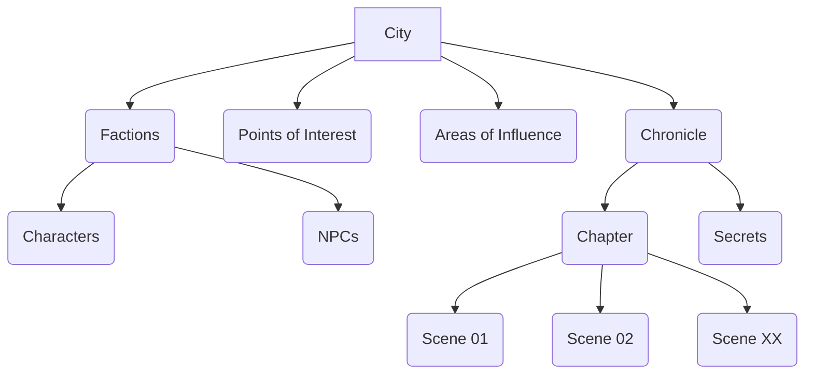
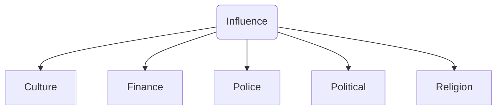
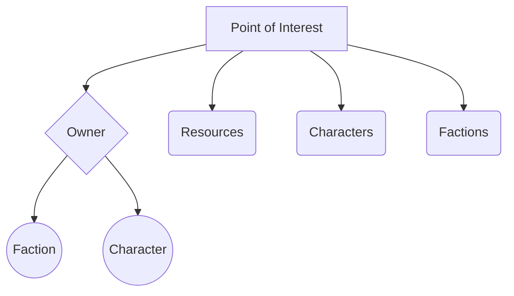
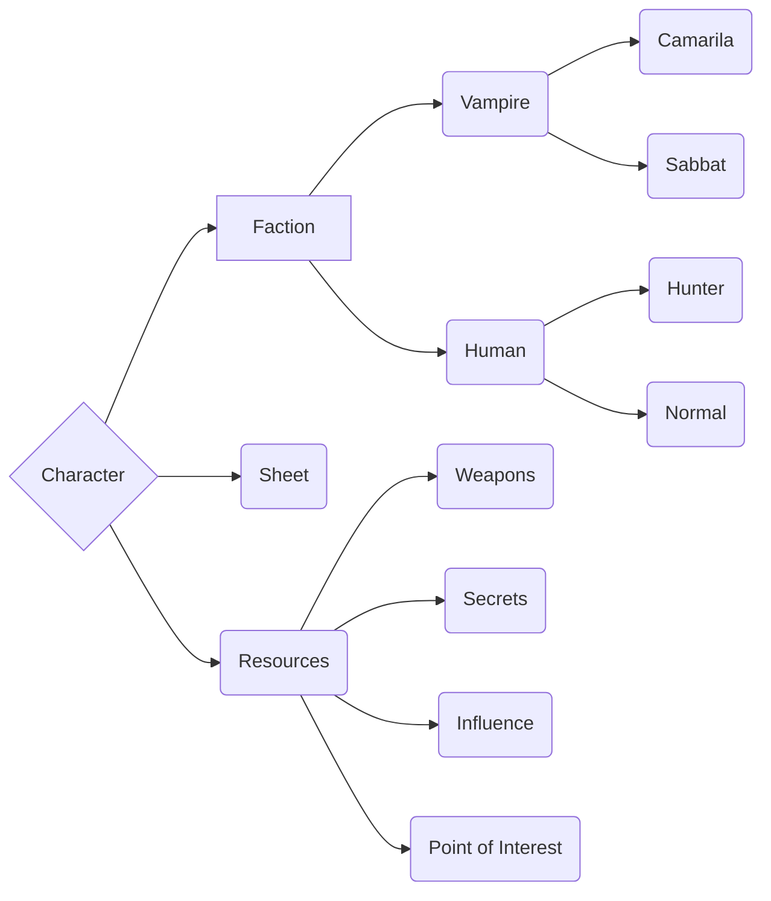

# Vampire Game


## General Concepts

The main idea right now is run the game using a 2D isometric map and a system of turn-based events in some specific cases like:

- combat maneuvers 
- secrets discover 
- acquire area influence 
- improve relationship
- learn skills

This also means that in case of only movement through the city, the game would run like an open world with some minor challenges to acquire experience to learn new skills.

---

## Relationship Diagrams

### City


### Areas of Influence


### Points Of Interest


### Factions and Characters


Each faction contains a set of characters, single powers, locations their own, secrets they share and influence areas of the city
 
 - **Secrets**: 
 - **Locations** : Church, Police Station, Bank, Elysium, Night Club, ...
 - **Single Powers**: Potence, Speed,
 - **City Influence** : Culture, Finance, Police, Political, Religion

---

## Human Sheets

```python
import vampire as vampire_game
human = vampire_game.players.Human()
human.greet()
```

output:
```txt
-> action: the Human with name Phillip Baker says "Hello.."
:. - attrs   -> force: 3, dexterity: 3, stamina: 1
:. - attrs   -> charisma: 1, manipulation: 4, appearence: 0
:. - attrs   -> perception: 0, inteligence: 2, wits: 1
:. - abils   -> alertness: 4, athletics: 4, brawl: 1, dodge: 0, intimidation: 0
:. - abils   -> animal ken: 2, drive: 2, firearms: 3, melee: 0, stealth: 0
:. - abils   -> academics: 1, finance: 2, investigation: 2, medicine: 0, occult: 0
:. [Phillip Baker] -> health: 14, is_dead: False, humanity: 9, willpower: 6, bloodpool: 10 / 10, penalty: 0
```
---

## Vampire Sheets

```python
import vampire as vampire_game
human = vampire_game.players.Vampire()
human.greet()
```

output:
```txt
-> action: the Vampire with name Lucas Norman says "Hello.."
:. - attrs   -> force: 2, dexterity: 5, stamina: 2
:. - attrs   -> charisma: 3, manipulation: 3, appearence: 1
:. - attrs   -> perception: 2, inteligence: 0, wits: 1
:. - abils   -> alertness: 2, athletics: 3, brawl: 2, dodge: 0, intimidation: 0
:. - abils   -> animal ken: 2, drive: 3, firearms: 4, melee: 0, stealth: 0
:. - abils   -> academics: 2, finance: 3, investigation: 0, medicine: 0, occult: 0
:. [Lucas Norman] -> health: 14, is_dead: False, humanity: 6, willpower: 4, bloodpool: 10 / 11, penalty: 0
```

---

## Combat Example

```python
import vampire as vampire_game
human = vampire_game.game.battle([Human, Vampire])
```

output:
```txt
Phillip Baker rolling a dice for inititive (1, [3, 10, 1, 9], 6)...
Lucas Norman rolling a dice for inititive (2, [8, 4, 5, 5, 5, 7], 6)...
Lucas Norman rolling a dice for attack (1, [7, 1, 10], 6)...
Phillip Baker rolling a dice for absorb (-1, [1], 6)...
:. Vampire "Lucas Norman" -> health: 14, is_dead: False, humanity: 6, willpower: 4, bloodpool: 10 / 11, penalty: 0
:. Human "Phillip Baker" -> health: 13, is_dead: False, humanity: 9, willpower: 6, bloodpool: 10 / 10, penalty: 0
-> The player Lucas Norman attacked Phillip Baker inflicting 1 points
Phillip Baker rolling a dice for attack (1, [5, 3, 5, 9], 6)...
Lucas Norman rolling a dice for absorb (0, [3, 2], 6)...
:. Human "Phillip Baker" -> health: 13, is_dead: False, humanity: 9, willpower: 6, bloodpool: 10 / 10, penalty: 0
:. Vampire "Lucas Norman" -> health: 14, is_dead: False, humanity: 6, willpower: 4, bloodpool: 10 / 11, penalty: 0
-> The enemy Lucas Norman absorbed the attack from Phillip Baker!

Phillip Baker rolling a dice for inititive (-2, [1, 1, 5, 2], 6)...
Lucas Norman rolling a dice for inititive (3, [11, 4, 6, 10, 3, 2], 6)...
Lucas Norman rolling a dice for attack (1, [2, 8, 3], 6)...
Phillip Baker rolling a dice for absorb (0, [3], 6)...
:. Vampire "Lucas Norman" -> health: 14, is_dead: False, humanity: 6, willpower: 4, bloodpool: 10 / 11, penalty: 0
:. Human "Phillip Baker" -> health: 13, is_dead: False, humanity: 9, willpower: 6, bloodpool: 10 / 10, penalty: 0
-> The enemy Phillip Baker absorbed the attack from Lucas Norman!
Phillip Baker rolling a dice for attack (3, [9, 11, 4, 8], 6)...
Lucas Norman rolling a dice for absorb (2, [6, 6], 6)...
:. Human "Phillip Baker" -> health: 13, is_dead: False, humanity: 9, willpower: 6, bloodpool: 10 / 10, penalty: 0
:. Vampire "Lucas Norman" -> health: 14, is_dead: False, humanity: 6, willpower: 4, bloodpool: 10 / 11, penalty: 0
-> The enemy Lucas Norman absorbed the attack from Phillip Baker!

Phillip Baker rolling a dice for inititive (2, [9, 2, 10, 5], 6)...
Lucas Norman rolling a dice for inititive (1, [4, 8, 3, 4, 3, 3], 6)...
Phillip Baker rolling a dice for attack (2, [6, 10, 11, 1], 6)...
Lucas Norman rolling a dice for absorb (2, [8, 8], 6)...
:. Human "Phillip Baker" -> health: 13, is_dead: False, humanity: 9, willpower: 6, bloodpool: 10 / 10, penalty: 0
:. Vampire "Lucas Norman" -> health: 14, is_dead: False, humanity: 6, willpower: 4, bloodpool: 10 / 11, penalty: 0
-> The enemy Lucas Norman absorbed the attack from Phillip Baker!
Lucas Norman rolling a dice for attack (0, [6, 1, 5], 6)...

Phillip Baker rolling a dice for inititive (1, [5, 4, 3, 6], 6)...
Lucas Norman rolling a dice for inititive (1, [3, 10, 5, 10, 1, 4], 6)...
Lucas Norman rolling a dice for attack (1, [7, 9, 1], 6)...
Phillip Baker rolling a dice for absorb (1, [6], 6)...
:. Vampire "Lucas Norman" -> health: 14, is_dead: False, humanity: 6, willpower: 4, bloodpool: 10 / 11, penalty: 0
:. Human "Phillip Baker" -> health: 13, is_dead: False, humanity: 9, willpower: 6, bloodpool: 10 / 10, penalty: 0
-> The enemy Phillip Baker absorbed the attack from Lucas Norman!
Phillip Baker rolling a dice for attack (4, [8, 6, 8, 10], 6)...
Lucas Norman rolling a dice for absorb (1, [10, 4], 6)...
:. Human "Phillip Baker" -> health: 13, is_dead: False, humanity: 9, willpower: 6, bloodpool: 10 / 10, penalty: 0
:. Vampire "Lucas Norman" -> health: 12, is_dead: False, humanity: 6, willpower: 4, bloodpool: 10 / 11, penalty: -1
-> The player Phillip Baker attacked Lucas Norman inflicting 2 points

Phillip Baker rolling a dice for inititive (1, [2, 9, 1, 11], 6)...
Lucas Norman rolling a dice for inititive (5, [3, 6, 7, 9, 7, 10], 6)...
Lucas Norman rolling a dice for attack (4, [11, 7, 11, 7], 6)...
Phillip Baker rolling a dice for absorb (-1, [1], 6)...
:. Vampire "Lucas Norman" -> health: 12, is_dead: False, humanity: 6, willpower: 4, bloodpool: 10 / 11, penalty: -1
:. Human "Phillip Baker" -> health: 11, is_dead: False, humanity: 9, willpower: 6, bloodpool: 10 / 10, penalty: -1
-> The player Lucas Norman attacked Phillip Baker inflicting 2 points
Phillip Baker rolling a dice for attack (2, [2, 8, 11, 11, 1], 6)...
Lucas Norman rolling a dice for absorb (1, [10, 4, 4], 6)...
:. Human "Phillip Baker" -> health: 11, is_dead: False, humanity: 9, willpower: 6, bloodpool: 10 / 10, penalty: -1
:. Vampire "Lucas Norman" -> health: 12, is_dead: False, humanity: 6, willpower: 4, bloodpool: 10 / 11, penalty: -1
-> The enemy Lucas Norman absorbed the attack from Phillip Baker!

Phillip Baker rolling a dice for inititive (0, [10, 1, 1, 7], 6)...
Lucas Norman rolling a dice for inititive (3, [5, 7, 8, 7, 3, 5], 6)...
Lucas Norman rolling a dice for attack (3, [2, 9, 9, 10], 6)...
Phillip Baker rolling a dice for absorb (1, [11, 3], 6)...
:. Vampire "Lucas Norman" -> health: 12, is_dead: False, humanity: 6, willpower: 4, bloodpool: 10 / 11, penalty: -1
:. Human "Phillip Baker" -> health: 10, is_dead: False, humanity: 9, willpower: 6, bloodpool: 10 / 10, penalty: -1
-> The player Lucas Norman attacked Phillip Baker inflicting 1 points
Phillip Baker rolling a dice for attack (3, [11, 6, 10, 3, 2], 6)...
Lucas Norman rolling a dice for absorb (3, [10, 7, 11], 6)...
:. Human "Phillip Baker" -> health: 10, is_dead: False, humanity: 9, willpower: 6, bloodpool: 10 / 10, penalty: -1
:. Vampire "Lucas Norman" -> health: 12, is_dead: False, humanity: 6, willpower: 4, bloodpool: 10 / 11, penalty: -1
-> The enemy Lucas Norman absorbed the attack from Phillip Baker!

Phillip Baker rolling a dice for inititive (1, [6, 1, 11, 5], 6)...
Lucas Norman rolling a dice for inititive (2, [11, 2, 4, 5, 10, 5], 6)...
Lucas Norman rolling a dice for attack (2, [11, 11, 1, 6], 6)...
Phillip Baker rolling a dice for absorb (0, [7, 1], 6)...
:. Vampire "Lucas Norman" -> health: 12, is_dead: False, humanity: 6, willpower: 4, bloodpool: 10 / 11, penalty: -1
:. Human "Phillip Baker" -> health: 9, is_dead: False, humanity: 9, willpower: 6, bloodpool: 10 / 10, penalty: -1
-> The player Lucas Norman attacked Phillip Baker inflicting 1 points
Phillip Baker rolling a dice for attack (3, [2, 3, 9, 6, 7], 6)...
Lucas Norman rolling a dice for absorb (1, [10, 5, 3], 6)...
:. Human "Phillip Baker" -> health: 9, is_dead: False, humanity: 9, willpower: 6, bloodpool: 10 / 10, penalty: -1
:. Vampire "Lucas Norman" -> health: 11, is_dead: False, humanity: 6, willpower: 4, bloodpool: 10 / 11, penalty: -1
-> The player Phillip Baker attacked Lucas Norman inflicting 1 points

Phillip Baker rolling a dice for inititive (2, [1, 8, 6, 8], 6)...
Lucas Norman rolling a dice for inititive (4, [9, 8, 4, 3, 8, 6], 6)...
Lucas Norman rolling a dice for attack (4, [10, 11, 6, 8], 6)...
Phillip Baker rolling a dice for absorb (2, [10, 7], 6)...
:. Vampire "Lucas Norman" -> health: 11, is_dead: False, humanity: 6, willpower: 4, bloodpool: 10 / 11, penalty: -1
:. Human "Phillip Baker" -> health: 8, is_dead: False, humanity: 9, willpower: 6, bloodpool: 10 / 10, penalty: -2
-> The player Lucas Norman attacked Phillip Baker inflicting 1 points
Phillip Baker rolling a dice for attack (3, [9, 3, 4, 9, 8, 4], 6)...
Lucas Norman rolling a dice for absorb (3, [9, 6, 9], 6)...
:. Human "Phillip Baker" -> health: 8, is_dead: False, humanity: 9, willpower: 6, bloodpool: 10 / 10, penalty: -2
:. Vampire "Lucas Norman" -> health: 11, is_dead: False, humanity: 6, willpower: 4, bloodpool: 10 / 11, penalty: -1
-> The enemy Lucas Norman absorbed the attack from Phillip Baker!

Phillip Baker rolling a dice for inititive (3, [10, 7, 11, 4], 6)...
Lucas Norman rolling a dice for inititive (-2, [1, 1, 11, 1, 4, 4], 6)...
Phillip Baker rolling a dice for attack (4, [8, 9, 7, 8, 1, 10], 6)...
Lucas Norman rolling a dice for absorb (2, [10, 4, 6], 6)...
:. Human "Phillip Baker" -> health: 8, is_dead: False, humanity: 9, willpower: 6, bloodpool: 10 / 10, penalty: -2
:. Vampire "Lucas Norman" -> health: 10, is_dead: False, humanity: 6, willpower: 4, bloodpool: 10 / 11, penalty: -1
-> The player Phillip Baker attacked Lucas Norman inflicting 1 points
Lucas Norman rolling a dice for attack (2, [9, 6, 3, 3], 6)...
Phillip Baker rolling a dice for absorb (2, [8, 10, 2], 6)...
:. Vampire "Lucas Norman" -> health: 10, is_dead: False, humanity: 6, willpower: 4, bloodpool: 10 / 11, penalty: -1
:. Human "Phillip Baker" -> health: 8, is_dead: False, humanity: 9, willpower: 6, bloodpool: 10 / 10, penalty: -2
-> The enemy Phillip Baker absorbed the attack from Lucas Norman!

Phillip Baker rolling a dice for inititive (0, [6, 1, 1, 6], 6)...
Lucas Norman rolling a dice for inititive (3, [11, 8, 3, 2, 4, 10], 6)...
Lucas Norman rolling a dice for attack (3, [6, 7, 4, 8], 6)...
Phillip Baker rolling a dice for absorb (1, [6, 5, 2], 6)...
:. Vampire "Lucas Norman" -> health: 10, is_dead: False, humanity: 6, willpower: 4, bloodpool: 10 / 11, penalty: -1
:. Human "Phillip Baker" -> health: 7, is_dead: False, humanity: 9, willpower: 6, bloodpool: 10 / 10, penalty: -2
-> The player Lucas Norman attacked Phillip Baker inflicting 1 points
Phillip Baker rolling a dice for attack (3, [8, 7, 7, 8, 5, 1], 6)...
Lucas Norman rolling a dice for absorb (-1, [1, 4, 4], 6)...
-> Vampire "Lucas Norman" spent 1 blood on Health
:. Human "Phillip Baker" -> health: 7, is_dead: False, humanity: 9, willpower: 6, bloodpool: 10 / 10, penalty: -2
:. Vampire "Lucas Norman" -> health: 10, is_dead: False, humanity: 6, willpower: 4, bloodpool: 10 / 10, penalty: -1
-> The player Phillip Baker attacked Lucas Norman inflicting 2 points

Phillip Baker rolling a dice for inititive (3, [10, 5, 8, 10], 6)...
Lucas Norman rolling a dice for inititive (1, [4, 7, 3, 2, 5, 5], 6)...
Phillip Baker rolling a dice for attack (4, [8, 8, 11, 8, 3, 5], 6)...
Lucas Norman rolling a dice for absorb (0, [1, 4, 9], 6)...
-> Vampire "Lucas Norman" spent 1 blood on Health
:. Human "Phillip Baker" -> health: 7, is_dead: False, humanity: 9, willpower: 6, bloodpool: 10 / 10, penalty: -2
:. Vampire "Lucas Norman" -> health: 10, is_dead: False, humanity: 6, willpower: 4, bloodpool: 10 / 9, penalty: -1
-> The player Phillip Baker attacked Lucas Norman inflicting 2 points
Lucas Norman rolling a dice for attack (4, [11, 9, 9, 9], 6)...
Phillip Baker rolling a dice for absorb (2, [2, 6, 6], 6)...
:. Vampire "Lucas Norman" -> health: 10, is_dead: False, humanity: 6, willpower: 4, bloodpool: 10 / 9, penalty: -1
:. Human "Phillip Baker" -> health: 6, is_dead: False, humanity: 9, willpower: 6, bloodpool: 10 / 10, penalty: -2
-> The player Lucas Norman attacked Phillip Baker inflicting 1 points

Phillip Baker rolling a dice for inititive (1, [5, 5, 5, 7], 6)...
Lucas Norman rolling a dice for inititive (4, [11, 4, 4, 7, 11, 6], 6)...
Lucas Norman rolling a dice for attack (1, [4, 10, 11, 1], 6)...
Phillip Baker rolling a dice for absorb (3, [6, 7, 9], 6)...
:. Vampire "Lucas Norman" -> health: 10, is_dead: False, humanity: 6, willpower: 4, bloodpool: 10 / 9, penalty: -1
:. Human "Phillip Baker" -> health: 6, is_dead: False, humanity: 9, willpower: 6, bloodpool: 10 / 10, penalty: -2
-> The enemy Phillip Baker absorbed the attack from Lucas Norman!
Phillip Baker rolling a dice for attack (1, [4, 10, 5, 11, 3, 1], 6)...
Lucas Norman rolling a dice for absorb (0, [4, 4, 2], 6)...
:. Human "Phillip Baker" -> health: 6, is_dead: False, humanity: 9, willpower: 6, bloodpool: 10 / 10, penalty: -2
:. Vampire "Lucas Norman" -> health: 10, is_dead: False, humanity: 6, willpower: 4, bloodpool: 10 / 9, penalty: -1
-> The enemy Lucas Norman absorbed the attack from Phillip Baker!

Phillip Baker rolling a dice for inititive (3, [8, 7, 8, 2], 6)...
Lucas Norman rolling a dice for inititive (2, [9, 10, 5, 9, 1, 2], 6)...
Phillip Baker rolling a dice for attack (3, [3, 4, 2, 9, 7, 9], 6)...
Lucas Norman rolling a dice for absorb (3, [6, 6, 6], 6)...
:. Human "Phillip Baker" -> health: 6, is_dead: False, humanity: 9, willpower: 6, bloodpool: 10 / 10, penalty: -2
:. Vampire "Lucas Norman" -> health: 10, is_dead: False, humanity: 6, willpower: 4, bloodpool: 10 / 9, penalty: -1
-> The enemy Lucas Norman absorbed the attack from Phillip Baker!
Lucas Norman rolling a dice for attack (1, [8, 3, 1, 9], 6)...
Phillip Baker rolling a dice for absorb (2, [7, 8, 2], 6)...
:. Vampire "Lucas Norman" -> health: 10, is_dead: False, humanity: 6, willpower: 4, bloodpool: 10 / 9, penalty: -1
:. Human "Phillip Baker" -> health: 6, is_dead: False, humanity: 9, willpower: 6, bloodpool: 10 / 10, penalty: -2
-> The enemy Phillip Baker absorbed the attack from Lucas Norman!

Phillip Baker rolling a dice for inititive (2, [6, 6, 1, 8], 6)...
Lucas Norman rolling a dice for inititive (1, [7, 2, 5, 2, 5, 5], 6)...
Phillip Baker rolling a dice for attack (3, [3, 3, 7, 8, 11, 2], 6)...
Lucas Norman rolling a dice for absorb (3, [9, 6, 9], 6)...
:. Human "Phillip Baker" -> health: 6, is_dead: False, humanity: 9, willpower: 6, bloodpool: 10 / 10, penalty: -2
:. Vampire "Lucas Norman" -> health: 10, is_dead: False, humanity: 6, willpower: 4, bloodpool: 10 / 9, penalty: -1
-> The enemy Lucas Norman absorbed the attack from Phillip Baker!
Lucas Norman rolling a dice for attack (0, [3, 3, 11, 1], 6)...

Phillip Baker rolling a dice for inititive (4, [11, 9, 8, 8], 6)...
Lucas Norman rolling a dice for inititive (3, [6, 3, 11, 9, 10, 1], 6)...
Phillip Baker rolling a dice for attack (4, [11, 6, 4, 11, 4, 6], 6)...
Lucas Norman rolling a dice for absorb (2, [6, 10, 3], 6)...
:. Human "Phillip Baker" -> health: 6, is_dead: False, humanity: 9, willpower: 6, bloodpool: 10 / 10, penalty: -2
:. Vampire "Lucas Norman" -> health: 9, is_dead: False, humanity: 6, willpower: 4, bloodpool: 10 / 9, penalty: -1
-> The player Phillip Baker attacked Lucas Norman inflicting 1 points
Lucas Norman rolling a dice for attack (1, [3, 10, 4, 4], 6)...
Phillip Baker rolling a dice for absorb (3, [7, 8, 7], 6)...
:. Vampire "Lucas Norman" -> health: 9, is_dead: False, humanity: 6, willpower: 4, bloodpool: 10 / 9, penalty: -1
:. Human "Phillip Baker" -> health: 6, is_dead: False, humanity: 9, willpower: 6, bloodpool: 10 / 10, penalty: -2
-> The enemy Phillip Baker absorbed the attack from Lucas Norman!

Phillip Baker rolling a dice for inititive (4, [8, 7, 7, 7], 6)...
Lucas Norman rolling a dice for inititive (2, [4, 2, 2, 8, 8, 4], 6)...
Phillip Baker rolling a dice for attack (1, [5, 5, 7, 7, 3, 1], 6)...
Lucas Norman rolling a dice for absorb (1, [9, 2, 2], 6)...
:. Human "Phillip Baker" -> health: 6, is_dead: False, humanity: 9, willpower: 6, bloodpool: 10 / 10, penalty: -2
:. Vampire "Lucas Norman" -> health: 9, is_dead: False, humanity: 6, willpower: 4, bloodpool: 10 / 9, penalty: -1
-> The enemy Lucas Norman absorbed the attack from Phillip Baker!
Lucas Norman rolling a dice for attack (1, [8, 7, 1, 3], 6)...
Phillip Baker rolling a dice for absorb (2, [5, 7, 7], 6)...
:. Vampire "Lucas Norman" -> health: 9, is_dead: False, humanity: 6, willpower: 4, bloodpool: 10 / 9, penalty: -1
:. Human "Phillip Baker" -> health: 6, is_dead: False, humanity: 9, willpower: 6, bloodpool: 10 / 10, penalty: -2
-> The enemy Phillip Baker absorbed the attack from Lucas Norman!

Phillip Baker rolling a dice for inititive (2, [6, 3, 8, 4], 6)...
Lucas Norman rolling a dice for inititive (2, [2, 9, 1, 11, 2, 10], 6)...
Phillip Baker rolling a dice for attack (3, [4, 7, 9, 4, 3, 10], 6)...
Lucas Norman rolling a dice for absorb (2, [9, 9, 5], 6)...
:. Human "Phillip Baker" -> health: 6, is_dead: False, humanity: 9, willpower: 6, bloodpool: 10 / 10, penalty: -2
:. Vampire "Lucas Norman" -> health: 9, is_dead: False, humanity: 6, willpower: 4, bloodpool: 10 / 9, penalty: -1
-> The enemy Lucas Norman absorbed the attack from Phillip Baker!
Lucas Norman rolling a dice for attack (0, [3, 9, 3, 1], 6)...

Phillip Baker rolling a dice for inititive (1, [3, 6, 1, 9], 6)...
Lucas Norman rolling a dice for inititive (2, [11, 1, 4, 10, 3, 8], 6)...
Lucas Norman rolling a dice for attack (2, [5, 3, 8, 9], 6)...
Phillip Baker rolling a dice for absorb (0, [9, 1, 4], 6)...
:. Vampire "Lucas Norman" -> health: 9, is_dead: False, humanity: 6, willpower: 4, bloodpool: 10 / 9, penalty: -1
:. Human "Phillip Baker" -> health: 5, is_dead: False, humanity: 9, willpower: 6, bloodpool: 10 / 10, penalty: -2
-> The player Lucas Norman attacked Phillip Baker inflicting 1 points
Phillip Baker rolling a dice for attack (4, [5, 7, 10, 3, 10, 7], 6)...
Lucas Norman rolling a dice for absorb (2, [5, 10, 8], 6)...
-> Vampire "Lucas Norman" spent 1 blood on Health
:. Human "Phillip Baker" -> health: 5, is_dead: False, humanity: 9, willpower: 6, bloodpool: 10 / 10, penalty: -2
:. Vampire "Lucas Norman" -> health: 10, is_dead: False, humanity: 6, willpower: 4, bloodpool: 10 / 8, penalty: -1
-> The player Phillip Baker attacked Lucas Norman inflicting 1 points

Phillip Baker rolling a dice for inititive (2, [4, 4, 10, 11], 6)...
Lucas Norman rolling a dice for inititive (4, [9, 9, 3, 10, 3, 8], 6)...
Lucas Norman rolling a dice for attack (2, [1, 11, 11, 11], 6)...
Phillip Baker rolling a dice for absorb (1, [5, 8, 2], 6)...
:. Vampire "Lucas Norman" -> health: 10, is_dead: False, humanity: 6, willpower: 4, bloodpool: 10 / 8, penalty: -1
:. Human "Phillip Baker" -> health: 5, is_dead: False, humanity: 9, willpower: 6, bloodpool: 10 / 10, penalty: -2
-> The enemy Phillip Baker absorbed the attack from Lucas Norman!
Phillip Baker rolling a dice for attack (2, [1, 10, 6, 4, 2, 10], 6)...
Lucas Norman rolling a dice for absorb (2, [3, 10, 11], 6)...
:. Human "Phillip Baker" -> health: 5, is_dead: False, humanity: 9, willpower: 6, bloodpool: 10 / 10, penalty: -2
:. Vampire "Lucas Norman" -> health: 10, is_dead: False, humanity: 6, willpower: 4, bloodpool: 10 / 8, penalty: -1
-> The enemy Lucas Norman absorbed the attack from Phillip Baker!

Phillip Baker rolling a dice for inititive (1, [9, 4, 4, 3], 6)...
Lucas Norman rolling a dice for inititive (3, [8, 11, 2, 10, 2, 2], 6)...
Lucas Norman rolling a dice for attack (2, [2, 8, 4, 9], 6)...
Phillip Baker rolling a dice for absorb (1, [3, 2, 8], 6)...
:. Vampire "Lucas Norman" -> health: 10, is_dead: False, humanity: 6, willpower: 4, bloodpool: 10 / 8, penalty: -1
:. Human "Phillip Baker" -> health: 5, is_dead: False, humanity: 9, willpower: 6, bloodpool: 10 / 10, penalty: -2
-> The enemy Phillip Baker absorbed the attack from Lucas Norman!
Phillip Baker rolling a dice for attack (4, [9, 3, 10, 6, 2, 6], 6)...
Lucas Norman rolling a dice for absorb (1, [5, 8, 2], 6)...
-> Vampire "Lucas Norman" spent 1 blood on Health
:. Human "Phillip Baker" -> health: 5, is_dead: False, humanity: 9, willpower: 6, bloodpool: 10 / 10, penalty: -2
:. Vampire "Lucas Norman" -> health: 10, is_dead: False, humanity: 6, willpower: 4, bloodpool: 10 / 7, penalty: -1
-> The player Phillip Baker attacked Lucas Norman inflicting 2 points

Phillip Baker rolling a dice for inititive (3, [8, 10, 7, 3], 6)...
Lucas Norman rolling a dice for inititive (3, [11, 7, 5, 11, 1, 7], 6)...
Lucas Norman rolling a dice for attack (2, [4, 7, 11, 4], 6)...
Phillip Baker rolling a dice for absorb (0, [4, 2, 3], 6)...
:. Vampire "Lucas Norman" -> health: 10, is_dead: False, humanity: 6, willpower: 4, bloodpool: 10 / 7, penalty: -1
:. Human "Phillip Baker" -> health: 4, is_dead: False, humanity: 9, willpower: 6, bloodpool: 10 / 10, penalty: -5
-> The player Lucas Norman attacked Phillip Baker inflicting 1 points
Phillip Baker rolling a dice for attack (3, [7, 11, 4, 5, 8, 5, 1, 4, 6], 6)...
Lucas Norman rolling a dice for absorb (0, [1, 2, 6], 6)...
-> Vampire "Lucas Norman" spent 1 blood on Health
:. Human "Phillip Baker" -> health: 4, is_dead: False, humanity: 9, willpower: 6, bloodpool: 10 / 10, penalty: -5
:. Vampire "Lucas Norman" -> health: 10, is_dead: False, humanity: 6, willpower: 4, bloodpool: 10 / 6, penalty: -1
-> The player Phillip Baker attacked Lucas Norman inflicting 2 points

Phillip Baker rolling a dice for inititive (-1, [2, 11, 1, 1], 6)...
Lucas Norman rolling a dice for inititive (2, [7, 5, 1, 10, 5, 8], 6)...
Lucas Norman rolling a dice for attack (2, [2, 2, 11, 10], 6)...
Phillip Baker rolling a dice for absorb (1, [11, 1, 8, 5, 1, 7], 6)...
:. Vampire "Lucas Norman" -> health: 10, is_dead: False, humanity: 6, willpower: 4, bloodpool: 10 / 6, penalty: -1
:. Human "Phillip Baker" -> health: 4, is_dead: False, humanity: 9, willpower: 6, bloodpool: 10 / 10, penalty: -5
-> The enemy Phillip Baker absorbed the attack from Lucas Norman!
Phillip Baker rolling a dice for attack (6, [11, 10, 9, 1, 11, 8, 10, 9, 2], 6)...
Lucas Norman rolling a dice for absorb (1, [3, 4, 6], 6)...
-> Vampire "Lucas Norman" spent 1 blood on Health
:. Human "Phillip Baker" -> health: 4, is_dead: False, humanity: 9, willpower: 6, bloodpool: 10 / 10, penalty: -5
:. Vampire "Lucas Norman" -> health: 10, is_dead: False, humanity: 6, willpower: 4, bloodpool: 10 / 5, penalty: -1
-> The player Phillip Baker attacked Lucas Norman inflicting 2 points

Phillip Baker rolling a dice for inititive (3, [6, 7, 6, 4], 6)...
Lucas Norman rolling a dice for inititive (5, [7, 8, 8, 11, 8, 5], 6)...
Lucas Norman rolling a dice for attack (2, [7, 2, 2, 10], 6)...
Phillip Baker rolling a dice for absorb (3, [9, 1, 3, 9, 7, 11], 6)...
:. Vampire "Lucas Norman" -> health: 10, is_dead: False, humanity: 6, willpower: 4, bloodpool: 10 / 5, penalty: -1
:. Human "Phillip Baker" -> health: 4, is_dead: False, humanity: 9, willpower: 6, bloodpool: 10 / 10, penalty: -5
-> The enemy Phillip Baker absorbed the attack from Lucas Norman!
Phillip Baker rolling a dice for attack (9, [7, 8, 9, 8, 9, 11, 8, 7, 11], 6)...
Lucas Norman rolling a dice for absorb (3, [10, 7, 9], 6)...
-> Vampire "Lucas Norman" spent 1 blood on Health
:. Human "Phillip Baker" -> health: 4, is_dead: False, humanity: 9, willpower: 6, bloodpool: 10 / 10, penalty: -5
:. Vampire "Lucas Norman" -> health: 9, is_dead: False, humanity: 6, willpower: 4, bloodpool: 10 / 4, penalty: -1
-> The player Phillip Baker attacked Lucas Norman inflicting 3 points

Phillip Baker rolling a dice for inititive (4, [8, 9, 8, 10], 6)...
Lucas Norman rolling a dice for inititive (1, [10, 10, 6, 5, 1, 1], 6)...
Phillip Baker rolling a dice for attack (3, [5, 10, 3, 7, 10, 6, 1, 1, 10], 6)...
Lucas Norman rolling a dice for absorb (3, [7, 7, 8], 6)...
:. Human "Phillip Baker" -> health: 4, is_dead: False, humanity: 9, willpower: 6, bloodpool: 10 / 10, penalty: -5
:. Vampire "Lucas Norman" -> health: 9, is_dead: False, humanity: 6, willpower: 4, bloodpool: 10 / 4, penalty: -1
-> The enemy Lucas Norman absorbed the attack from Phillip Baker!
Lucas Norman rolling a dice for attack (2, [9, 1, 10, 6], 6)...
Phillip Baker rolling a dice for absorb (0, [1, 1, 8, 1, 8, 7], 6)...
:. Vampire "Lucas Norman" -> health: 9, is_dead: False, humanity: 6, willpower: 4, bloodpool: 10 / 4, penalty: -1
:. Human "Phillip Baker" -> health: 3, is_dead: False, humanity: 9, willpower: 6, bloodpool: 10 / 10, penalty: -5
-> The player Lucas Norman attacked Phillip Baker inflicting 1 points

Phillip Baker rolling a dice for inititive (3, [9, 4, 7, 10], 6)...
Lucas Norman rolling a dice for inititive (1, [2, 7, 2, 1, 9, 2], 6)...
Phillip Baker rolling a dice for attack (5, [8, 5, 3, 11, 2, 9, 9, 2, 7], 6)...
Lucas Norman rolling a dice for absorb (1, [1, 6, 7], 6)...
-> Vampire "Lucas Norman" is Hungry (blood: 4) and not willing to spend blood
:. Human "Phillip Baker" -> health: 3, is_dead: False, humanity: 9, willpower: 6, bloodpool: 10 / 10, penalty: -5
:. Vampire "Lucas Norman" -> health: 7, is_dead: False, humanity: 6, willpower: 4, bloodpool: 10 / 4, penalty: -2
-> The player Phillip Baker attacked Lucas Norman inflicting 2 points
Lucas Norman rolling a dice for attack (0, [1, 1, 4, 8, 11], 6)...

Phillip Baker rolling a dice for inititive (3, [8, 4, 11, 8], 6)...
Lucas Norman rolling a dice for inititive (1, [10, 6, 1, 5, 1, 11], 6)...
Phillip Baker rolling a dice for attack (7, [3, 7, 3, 9, 9, 10, 10, 9, 8], 6)...
Lucas Norman rolling a dice for absorb (2, [7, 2, 9, 4], 6)...
-> Vampire "Lucas Norman" is Hungry (blood: 4) and not willing to spend blood
:. Human "Phillip Baker" -> health: 3, is_dead: False, humanity: 9, willpower: 6, bloodpool: 10 / 10, penalty: -5
:. Vampire "Lucas Norman" -> health: 5, is_dead: False, humanity: 6, willpower: 4, bloodpool: 10 / 4, penalty: -2
-> The player Phillip Baker attacked Lucas Norman inflicting 2 points
Lucas Norman rolling a dice for attack (0, [1, 1, 2, 6, 7], 6)...

Phillip Baker rolling a dice for inititive (4, [6, 10, 6, 6], 6)...
Lucas Norman rolling a dice for inititive (5, [9, 11, 7, 10, 3, 6], 6)...
Lucas Norman rolling a dice for attack (3, [8, 9, 7, 2, 4], 6)...
Phillip Baker rolling a dice for absorb (0, [3, 5, 2, 2, 5, 4], 6)...
:. Vampire "Lucas Norman" -> health: 5, is_dead: False, humanity: 6, willpower: 4, bloodpool: 10 / 4, penalty: -2
:. Human "Phillip Baker" -> health: 0, is_dead: True, humanity: 9, willpower: 6, bloodpool: 10 / 10, penalty: -100
-> The Human with name Phillip Baker died!
```